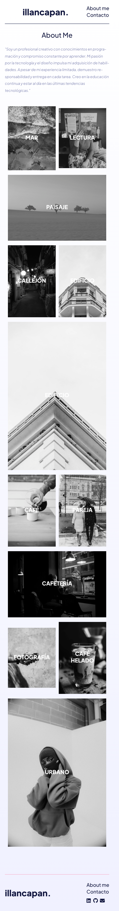

# Portafolio Personal: Enfoque Fotográfico

👉 **Vista la preview en el siguiente [link](https://illancapan.github.io/desafio-10/).**

¡Hola! Soy Igor LLancapán, estudiante del curso Desarrollo Full Stack JavaScript, Desafío Latam, y estoy emocionado de presentarte mi proyecto real: un enfoque fotográfico en mi portafolio personal.

## Detalles Clave

- **Tecnologías Utilizadas:**
  - HTML5 y CSS3 para estructura y estilo.
  - Diseño Responsive para una experiencia consistente.
- **Palabras Claves:**
  - Desarrollador Front-End.
  - Analista Programador.

## Vista Rápida

- **375px:** 
- **600px:** 
- **768px:** 
- **1024px:** 
